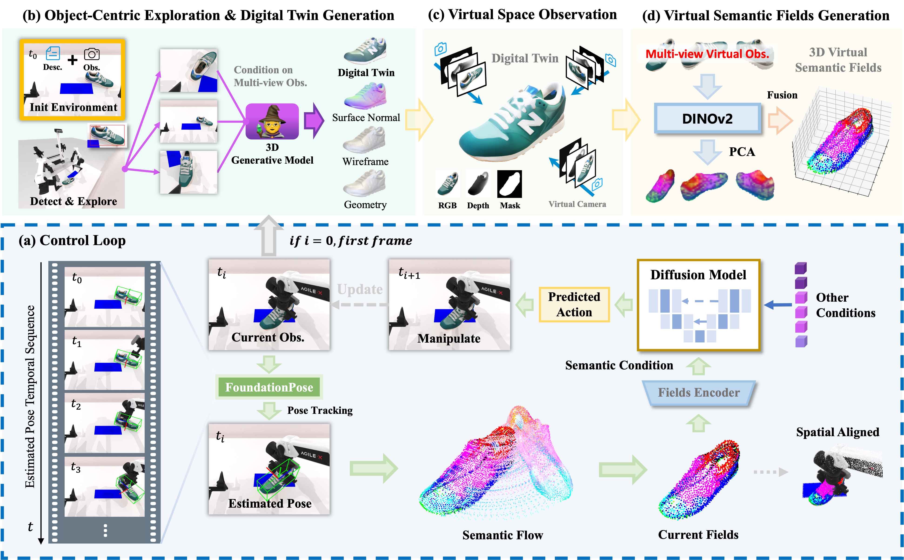

<h1 align="center">
	G3Flow: Generative 3D Semantic Flow for Pose-aware and Generalizable Object Manipulation<br>
</h1>

[Project Page](https://tianxingchen.github.io/G3Flow/) | [PDF](https://tianxingchen.github.io/G3Flow/files/G3Flow.pdf) | [arXiv](https://arxiv.org/abs/2411.18369) | [](https://hits.seeyoufarm.com)

<a href="https://tianxingchen.github.io/">Tianxing Chen</a><sup>\*</sup>, <a href="https://yaomarkmu.github.io/">Yao Mu</a><sup>* †</sup>, <a href="https://liang-zx.github.io/">Zhixuan Liang</a><sup>\*</sup>, Zanxin Chen, Shijia Peng, Qiangyu Chen, Mingkun Xu, Ruizhen Hu, Hongyuan Zhang, Xuelong Li, <a href="http://luoping.me/">Ping Luo</a><sup>†</sup>.

# 📚 Overview

We present G3Flow, a novel approach that leverages foundation models to generate and maintain 3D semantic flow for enhanced robotic manipulation.

# 🛠️ Installation
See [INSTALLATION.md](./INSTALLATION.md) for installation instructions. It takes about 30 minutes for installation.

# 🧑🏻‍💻 Usage
## 1. Collect Expert Data
This step involves data collection on RoboTwin for different tasks, with each task collecting 100 sets of data, including point cloud and RGBD data.

**${task_name}**: `bottle_adjust_T`, `bottle_adjust_G`, `diverse_bottles_pick_G`, `shoe_place_T`, `shoe_place_G`, `shoes_place_T`, `shoes_place_G`, `tool_adjust_T`, `tool_adjust_G`.
```
cd RoboTwin_Benchmark
bash run_task.sh ${task_name} ${gpu_id}
cd ..
```

## 2. Process Data

This step will process the raw data to obtain G3Flow data for each moment, as well as a PCA model. The `n_component` parameter refers to the target dimensionality when using PCA for dimensionality reduction.

```
bash process_data.sh ${task_name} ${expert_data_num} ${n_components} ${gpu_id}
```
The processed data will be stored in the `G3FlowDP/data` directory, and the obtained PCA model will be stored in the `G3FlowDP/PCA_model` directory.


## 3. Train G3Flow-based Policy
```
bash train.sh ${task_name} ${expert_data_num} ${n_components} ${seed} ${gpu_id}
```

## 4. Evaluate G3Flow-based Policy
```
bash eval.sh ${task_name} ${expert_data_num} ${n_components} ${seed} ${gpu_id}
```

# 👍 Citation
If you find our work useful, please consider citing:

```
Coming Soon !
```

# 😺 Acknowledgement
Our code is generally built upon: [Diffusion Policy](https://github.com/real-stanford/diffusion_policy), [FoundationPose](https://github.com/NVlabs/FoundationPose), [Grounded-SAM](https://github.com/IDEA-Research/Grounded-Segment-Anything), [DP3](https://github.com/YanjieZe/3D-Diffusion-Policy). We thank all these authors for their nicely open sourced code and their great contributions to the community.

Contact [Tianxing Chen](https://tianxingchen.github.io) if you have any questions or suggestions.

# 🏷️ License
This repository is released under the MIT license. See [LICENSE](./LICENSE) for additional details.
